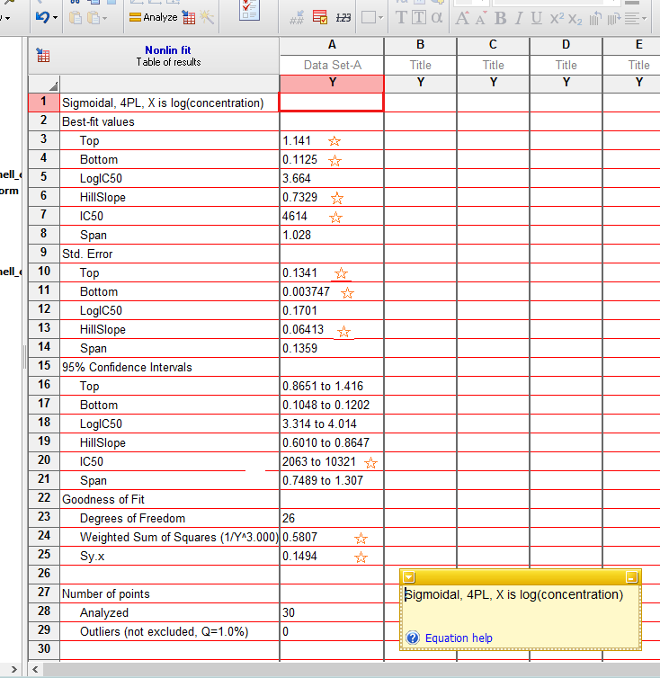

<!-- Section tabs -->
<ul class="nav nav-tabs" role="tablist">
  <li><a href="calib_overview.html">&laquo; Back to calibration overview</a></li>
  <li><a href="calib_tut4_curve_background.html">Background</a></li>
  <li><a href="calib_tut4_curve_ocon.html">O'Connell's ELISA</a></li>
  <li><a href="calib_tut4_curve_elisa.html">R's ELISA{gtools}</a></li>
</ul>
<br>

## Data analysis overview

```{r prep, include=FALSE}
# When working interactively (i.e. not calling this file from another
# function e.g. 'Knit' button or render() in outside script), set working
# directory to the location of this file. This way you will be working from
# the same perspective as those outside functions and paths will work
# either way.
# getwd()
# setwd("./source/R-new")

# Load packages and our functions
# Plot formatting
source("AMgraph.R")
# Our curve functions
source("AMfunctions.R")
# Data set tools
require(reshape2)
require(plyr)
require(dplyr) 
# Special regression package
require(minpack.lm)

data.path <- "../data" 

options(width=90, scipen = 4, show.signif.stars = FALSE)
```

Finally, we get into the core of calibration, the **curve-fitting** step, again using the O'Connell's ELISA data. This first example of curve-fitting and derivation of the inverse model is long because the steps in the analysis are explained in greater detail than in later examples. 

<!---

Also, later examples will use the functions created in this tutorial---indicated by the following code comments:

``` 
# ------- [function/algorithm name] ------
(...code...) 
# ------- end ---------

```

but readers who do not want to get into the details of writing functions, can simply run the code as usual, ignoring the instructional text about writing functions. 

--->

<!-- TODO in all the functions, add R package style preamble notes --> 


****  

#### Learning objectives for this section:

- Fit a calibration curve to one run of data using nonlinear regression (4PL):  
    - specify non-linear calibration curve functions in R;  
    - specify a weighting function that reflects change in variance with concentration (RER);  
    - specify initial values for the parameters of the calibration curve;  
    - use weighted and unweighted residual plots to evaluate model fit;   
    - approximate iteratively reweighted least squares (IRLS) regression.

- Calculate the inverse function of the calibration curve and:  
    - return predicted concentrations;  
    - estimate the variance of the predicted concentration.

***

## Basic curve-fitting

First we reload and examine the O'Connell ELISA data:

```{r ocon-entry}
# O'Connell ELISA data 
ocon <- read.csv(file.path(data.path, "ocon.csv"), header = TRUE)
head(ocon)
```


```{r ocon-plot, fig.width=13}
# Plot the O'Connell data
par(mfrow = c(1, 2), cex.main = 1, mar = c(4, 4, 1, 2), oma = c(0.5, 0.5, 2.5, 0))
plot(ocon$conc, ocon$od, pch = 21, bg = "grey", ylab = "Response (od)", 
     xlab = "Concentration")
grid()
# Plot on the log(x) scale
plot(log(ocon$conc), ocon$od, pch = 21, bg = "grey", ylab = "Response (od)", 
     xlab = "log(concentration)")
grid()
title("O'Connell's ELISA: concentration on absolute (left) and log (right) scales",
      outer = T)
par(mfrow = c(1, 1))
```

### Unweighted nonlinear regression in R

Unlike linear regression, nonlinear regression models are fit using an iterative algorithm, which requires starting values for each unknown parameter. Based on the plot above and the [interpretation of the parameters of the 4PL function](background.html), we can visually estimate reasonable starting values. Given the simple structure of the O’Connell data and the strong relationship between concentration and response, starting values do not need to be very accurate.

The mean of the zero-calibrators, 0.1, is a good starting value for parameter $d$. The upper asymptote, $a$, looks like it's going off to a limit of about 1. The $b$ parameter is harder to imagine, but for an ascending curve, a negative number is needed; -1 will do. From the log(concentration) plot, $c$, the inflection point, looks like it may be around 8 so on the absolute scale that is `r round(exp(8), 0)`. 

**Let's enter into R all the components for 4PL curve-fitting:**

```{r parms}
# ------------ Function: 4PL curve function ---------------------------------
# We actually loaded it ealier with source("../../AMfunctions.R"), 
# but this is what it looks like

M.4pl <- function(x, small.x.asymp, inf.x.asymp, inflec, hill){
    f <- small.x.asymp + ((inf.x.asymp - small.x.asymp)/
                              (1 + (x / inflec)^hill))
    return(f)
}
# ------------- end ---------------------------------------------------------

# Create a vector with the starting values
# Note: The order of the parameters is important. It determines the list index
# number in later functions.
start.ocon <- c(small.x.asymp = 0.1, inf.x.asymp = 1
                , inflec = 3000, hill = -1)
```

**Let's fit an unweighted 4PL curve first:**

```{r ocon-4pl}
uw.4pl <- nlsLM(od ~ M.4pl(conc, small.x.asymp, inf.x.asymp, inflec, hill), 
                     data = ocon,
                     start = start.ocon)
summary(uw.4pl)
```

**Interpretation of regression output:**

- `Formula` reminds us of the model we specified.

- `Parameters` lists the final point estimate and standard error for each parameter.

- `Residual standard error` is the square root of MSE, the unexplained variance.

- Convergence information: Notice that although our starting values were not very accurate, the model converged in only 5 iterations. Sometimes with more complex data structures or with sparse data sets, the algorithm will reach a built-in limit of iterations and we will need to change that limit, choose different starting values or treat some of the parameters as known. We will do this in the ["R's ELISA{gtools}"]() curve-fitting tutorial.

**What we're looking for in a regression model (in order of importance):**

- Convergence.  

- Do the parameter estimates look reasonable?

- No model assumption violations:  From the residual plots (weighted residuals for weighted models), are the residuals evenly distributed around zero line?
    
Remember: R^2 and F-tests are not very meaningful with such highly correlated data i.e. known to have a strong relationship between x and y (see the [Background]()).

Using the output for our unweighted nonlinear model, let's interpret the model using the internal criteria listed above:

>- Convergence.  

The algorithm converged.

>- Do the parameter estimates look reasonable?

The parameter values have the expected sign and are in plausible ranges.

>- No model assumption violations...  

We can't answer this with the numerical summary output. Two graphical tools that can help verify regression assumptions are the fitted regression curve and the curve's standardised residuals. Standardised residuals are the residuals scaled to a normal distribution with standard deviation of 1. The distribution of the residuals can then more easily be judged unacceptably large or small. We wrote a [wrapper function, plotDiag](AWfunctions.html#plotDiag) to facilitate this:

```{r plotDiag, fig.width=12}
# plotDiag():
# Enter nlsLM model and overall plot title
plotDiag.nls(uw.4pl, "Unweighted 4PL calibration model for O'Connell's ELISA: uw.4pl")
```

>- No model assumption violations:  From the residual plots (weighted residuals for weighted models), are the residuals evenly distributed around zero line?

The fitted curve looks reasonable, but the residual plot illustrates the violation of the homoscedasticity assumption. This indicates that a weighted model is necessary.


### Basic weighted curve-fitting

One approach to modelling non-constant variance in a regression model is by assigning a weight to each observation such that the weights are inversely proportional to the variance. As discussed in the previous section, we typically notice an increasing association between the observed response and the response variance. We chose to model this using the power function, $Var(y|x) = a*E(y|x)^{theta}$, though other functions are possible. Note that $E(y|x)$ is the predicted value of the response (y) at a given concentration (x). To fit a weighted model within R, we use the `weights` argument in the nlsLM function. Recall from in the previous section that the best estimate for $theta$ was 3.   

```{r w4pl, fig.width=12}
# Weighted 4PL 
# Theta for weighting (from 'Characterising variance')
theta.ocon <- 3
y.curve <- predict(uw.4pl)
w.4pl <- nlsLM(od ~ M.4pl(conc, small.x.asymp, inf.x.asymp, inflec, hill), 
                    data = ocon,
                    start = start.ocon,
                    weights = (1 / y.curve^theta.ocon)
               )
summary(w.4pl)

plotDiag.nls(w.4pl, "Weighted 4PL calibration model for O'Connell's ELISA: w.4pl")
```

The fitted curve hardly changes, but the residuals look much better. Depending on the outlier criterion you use, one data point (for concentration = 23) may be considered an outlier. We prefer not to exclude borderline questionable points, however---especially when there are so few replicates.

In the original O'Connell tutorial, their modelling algorithm settles on a different value for theta: 2.4; that is, 2 x 1.2 because they use a parameterization in terms of standard deviation rather than variance [-@OConnell1993, p.110]. <!-- Nandini: Not sure if this insert is appropriate at this stage. --> **Let's see how a different $theta$ value affects residuals:**


```{r w4pl-lit, fig.width=12}
# A different theta, 2.4 (from the O'Connell article)
theta.ocon.lit <- 2.4
w.lit.4pl <- nlsLM(od ~ M.4pl(conc, small.x.asymp, inf.x.asymp, inflec, hill), 
                    data = ocon,
                    start = start.ocon,
                    weights = (1 / y.curve^theta.ocon.lit)
               )
summary(w.lit.4pl)
plotDiag.nls(w.lit.4pl, "Weighted 4PL calibration model for O'Connell's ELISA: w.lit.4pl")
```

Again, no visible difference in the fitted curve, but the weighted residuals plot changes a little. At this slightly lower value of $theta$, there seems to still be some increase in the residuals at high response values. A larger data set would be needed to make a definitive choice.

<!-- the following is for exploratory purposes and does not appear in the final output -->

```{r parts, eval=FALSE}
# What are the parts of the model object and summary object
summary(w.4pl)
weights(w.4pl)
mean(weights(w.4pl))
sum(weights(w.4pl))
# Unweighted residuals
resid(w.4pl)
# Unweighted sum of squares - use to compare models
sum(resid(w.4pl)^2)
# Unweighted MSE
sum(resid(w.4pl)^2)/summary(w.4pl)$df[[2]]
# Unweighted RSE
sqrt(sum(resid(w.4pl)^2)/summary(w.4pl)$df[[2]])

# Weighted residuals - use this for plotting
summary(w.4pl)$resid
# Same as 
sqrt(weights(w.4pl))*resid(w.4pl)
# Weighted sum of squares
sum(summary(w.4pl)$resid^2)
# RSE (sigma) - weighted
summary(w.4pl)$sigma
```

## Iteratively reweighted least squares algorithm

As we have seen, weighting has a very small effect on the fitted regression curve with these data, but a big effect on the error model. Therefore, we expect the error model may be sensitive to the representation of $y$ in the denominator of the weight function, as well as to $theta$. Generally the raw response values are not used. One could use mean response by calibrator group or the response predicted by the unweighted model. <!-- Doesn't work within knirt script (an environment thing, I think): The latter is what is done in `nlsLM(...weights = wfct())` using the `fitted` option; that is, the function is fitting the unweighted model, passing the predicted response values to the `wfct()` and re-fitting a weighted model. --> Iteratively reweighted regression goes a step further and repeats the cycle until the changes in weighted sum of squares fall below some threshold.

We have written our own approximation of an iteratively reweighted least squares (IRLS) algorithm as function, [IRLS](AWfunctions.html#IRLS), and a wrapper to display the results, [summaryIRLS](AWfunctions.html#summaryIRLS):

```{r irls, fig.width=12}
# Use new function IRLS.4pl()
# Provide data.frame, theta (using O'Connell's here), and start values
w2.4pl <- IRLS.4pl(df = ocon, theta = theta.ocon.lit, start = start.ocon)
summaryIRLS(w2.4pl)

# A slightly different version of plotDiag.nls() (used earlier)
plotDiag.irls(w2.4pl, "IRLS 4PL calibration model for O'Connell's ELISA: w2.4pl")
```


The GraphPad results are shown below. Remember that GraphPad does not include the zero-calibrator data, which may account for some differences in the results.



The parameter point estimates are virtually the same. Notice, like in O'Connell, GraphPad uses a parameterization that keeps the 'Hill Slope', or $b$, positive. For comparison on the inflection point, $c$, look at the 'IC50' values in GraphPad output (which they have transformed back from the estimated parameter, 'LogIC50'). R's standard errors are slightly narrower, but this is probably due to the slightly larger sample size that comes from including the zero-calibrators. 

Let's get some of the other statistics from our `w2.4pl$end.model` to compare with GraphPad output:

```{r w2-more}
# 95% confidence intervals for the parameters
print(confint(w2.4pl$end.model), digits = 4)
# Weighted sum of squares
print(sum(summary(w2.4pl$end.model)$resid^2), digits = 3)
# Sigma (RSE) - same as O'Connell's sigma in results on Fig 10
print(summary(w2.4pl$end.model)$sigma, digits = 3)
```

- Following from the SEs, R's 95% confidence intervals are slightly narrower, but essentially the same.  

- R's weighted sum of squares is larger because we have more of data points contributing to the sum of squares. Unlike weighted MSE, WSS is not averaged over the degrees of freedom.

- Residual Standard Error (R's `sigma` and GraphPad's 'Sy.x') are virtually the same.

****

Could re-run the algorithm using O'Connell's theta instead

Not run:

```{r theta-lit, eval=FALSE, fig.width=12}
# Using O'Connell's theta
w2.lit.ocon <- IRLS.4pl(df = ocon, theta = theta.ocon.lit, start = start.ocon)
summaryIRLS(w2.lit.ocon)
plotDiag.irls(w2.lit.ocon, "IRLS 4PL calibration model for O'Connell's ELISA: w2.lit.ocon")
```

**** 

Satisfied that our R analysis replicates the results from GraphPad and the O'Connell article, we can move on to the inverse function. 


## The inverse function and error model

Obtaining the inverse function of the 4PL function, being monotonic, is trivial. As given by Dunn and Wild [-@Dunn2013, p.327]

$$x = c \Big(\frac{a-d}{y-d} -1 \Big)^{1/b}$$

The error model for the inverse function is difficult, however. The most common methods for approximating the standard deviation of the predicted concentration are Wald and inversion intervals [ref]. O'Connell and colleagues recommend a 'Wald-type' interval based on [second order] Taylor series expansion [-@OConnell1993].


The [sdXhat function](AMfunctions.html#sdXhat) returns a data frame of triplets: a range of response values (`yp`), corresponding predicted concentration (`xp`) and the standard deviation of the predicted concentration (`sd.xp`).


```{r mod-statlib}

# Don't forget to include the desired theta value 
# (for the other arguments, the defaults are fine)
ocon.inv.theta.2.4 <- sdXhat.4pl(w2.4pl, theta = theta.ocon.lit)
head(ocon.inv.theta.2.4$inv.grid, 15) 

# Compare lines 8 and 9 to O'Connell LOD (p.)
# Since cv = sd/mean, if cv = 0.2 and mean = 88.72 then 
# sd = 0.2 x 88.72 = 17.74.
```

With this output, a simple program can then retrieve (sometimes with additional, but simple calculations):  

[because it is more portable]

- the predicted concentration for new response observations; 

- confidence or prediction intervals for the predicted concentration;  

- precision profile (based on coefficient of variation);  

- predictions for the working range (or Analytical Measurement Range) such as limits of detection, quantification.

Therefore, let's save the grid (and the data and model) for the next tutorial:

```{r save-grid}
save(ocon.inv.theta.2.4, file = "ocon.inv.theta.2.4.RData")
ocon.model.theta.2.4 <- w2.4pl[c(1,4)]
save(ocon.model.theta.2.4, file = "ocon.model.theta.2.4.RData")
```


## Summary

In this tutorial, we have fit a calibration curve to the O'Connell ELISA data using iteratively reweighted least squares and achieved virtually the same results as the published analysis and GraphPad. We also derived the inverse model from which we can estimate measures of expected performance in the next O'Connell ELISA tutorial.

For more curve-fitting practice, the (streamlined) procedure is repeated with the [R's ELISA data](calib_tut5_curve_elisa.html) (coming soon...). In that tutorial, you will hopefully see that what may have felt like a long, complicated analysis really isn't too bad.


<br>
<button type="button" class="btn"><a href="calib_tut5_precision_background.html"> Next: Concentration estimation and the precision profile &raquo;</a></button>
<!--
<button type="button" class="btn"><a href="elisa.html"> Tutorial: Data preparation for R's ELISA &raquo;</a></button>
-->
<br>


## References


